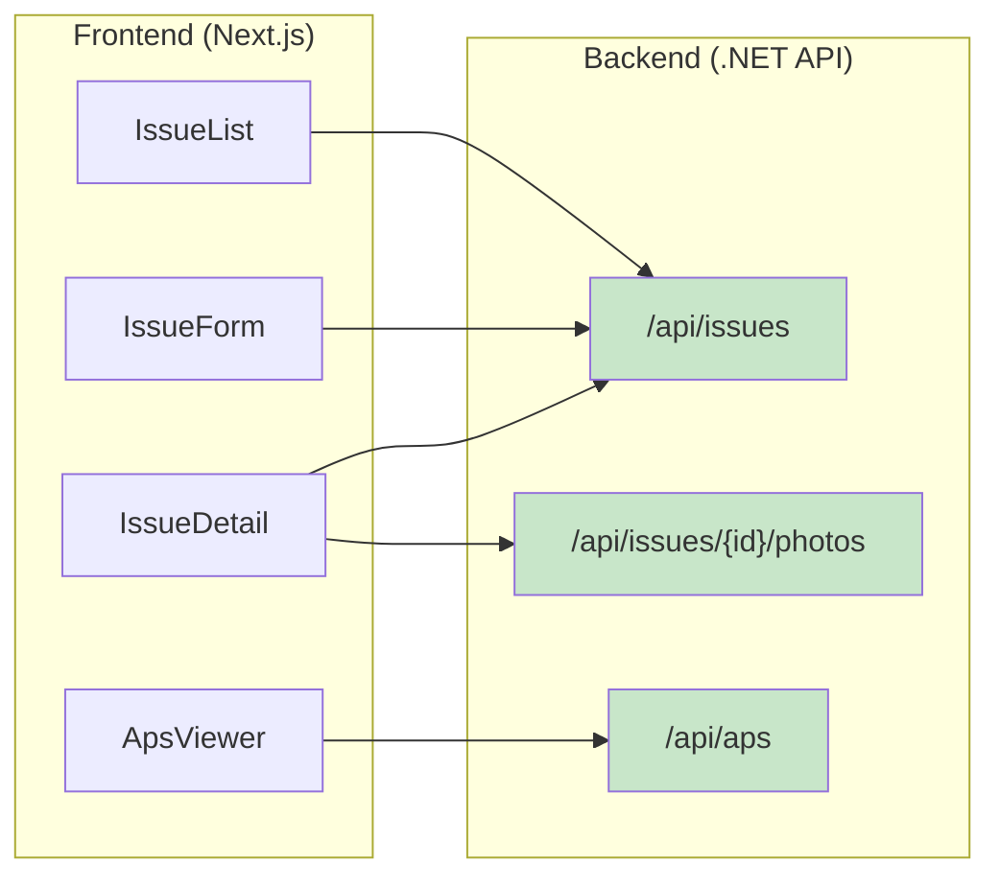

# API設計資料

Base URL: `http://localhost:5001/api`

---

## API概要図



## エンドポイント一覧

| メソッド | パス | 説明 |
|---------|------|------|
| GET | /issues | 指摘一覧取得 |
| POST | /issues | 指摘新規作成 |
| GET | /issues/{id} | 指摘詳細取得 |
| PATCH | /issues/{id}/status | 状態更新 |
| DELETE | /issues/{id} | 指摘削除 |
| POST | /issues/{id}/photos | 写真アップロード |
| GET | /issues/{id}/photos/{photoId}/url | 写真URL取得 |
| GET | /aps/viewer-token | Viewerトークン取得 |
| GET | /aps/urn | モデルURN取得 |

---

## Issues

### GET /issues
指摘一覧を取得する。

**Response 200**
```json
[
  {
    "id": "3fa85f64-5717-4562-b3fc-2c963f66afa6",
    "title": "手すり未設置",
    "description": "3階北側開口部に手すりがない",
    "issueType": "Safety",
    "status": "Open",
    "location": {
      "type": "Element",
      "dbId": 1234,
      "worldPosition": null
    },
    "photos": [
      {
        "id": "...",
        "blobKey": "photos/abc123.jpg",
        "label": "是正前",
        "url": "http://localhost:9000/project-bucket/photos/abc123.jpg?..."
      }
    ],
    "createdAt": "2026-03-15T05:00:00Z",
    "updatedAt": "2026-03-15T05:00:00Z"
  }
]
```

---

### POST /issues
指摘を新規登録する。

**Request Body**
```json
{
  "title": "手すり未設置",
  "description": "3階北側開口部に手すりがない",
  "issueType": "Safety",
  "location": {
    "type": "Element",
    "dbId": 1234,
    "worldPosition": null
  }
}
```

| フィールド | 型 | 必須 | 説明 |
|-----------|-----|------|------|
| title | string | ✅ | 指摘タイトル（最大255文字） |
| description | string | | 詳細説明 |
| issueType | enum | ✅ | Safety / Quality / Progress / Other |
| location.type | enum | ✅ | Element / Space |
| location.dbId | int | Element時必須 | APS ViewerのdbId |
| location.worldPosition | object | Space時必須 | {x, y, z} の3D座標 |

**Response 201**
```json
{ "id": "3fa85f64-..." }
```

---

### PATCH /issues/{id}/start-progress
ステータスを Open → InProgress に遷移する。

**Response 204** No Content

**Error 400** ステータスが Open でない場合
```json
{ "error": "Cannot start progress from current status: Done" }
```

---

### PATCH /issues/{id}/complete
ステータスを InProgress → Done に遷移する。

**Response 204** No Content

**Error 400** ステータスが InProgress でない場合

---

### DELETE /issues/{id}
指摘を削除する。

**Response 204** No Content

---

## Photos

### POST /photos/upload
写真をアップロードしてMinIOに保存する。

**Request** multipart/form-data

| フィールド | 型 | 必須 | 説明 |
|-----------|-----|------|------|
| issueId | UUID | ✅ | 紐付け先の指摘ID |
| file | File | ✅ | 画像ファイル（JPEG/PNG） |
| label | string | | 是正前 / 是正後 |

**Response 201**
```json
{
  "id": "...",
  "url": "http://localhost:9000/project-bucket/photos/abc123.jpg?X-Amz-Signature=..."
}
```

**処理フロー**:
1. MinIOにバイナリをアップロード
2. DBのphotosテーブルにblob_keyを登録
3. Presigned URL（有効期限1時間）を生成して返却

---

## APS

### GET /aps/token
APS 2-legged OAuthトークンを取得する。
フロントエンドがAPS ViewerをロードするためにClient Secretをブラウザに露出させないためのプロキシ。

**Response 200**
```json
{
  "access_token": "eyJhbGci...",
  "expires_in": 3599
}
```

---

## エラーレスポンス共通形式
```json
{
  "error": "エラーの説明",
  "detail": "任意の詳細情報"
}
```

| HTTPステータス | 意味 |
|--------------|------|
| 400 | バリデーションエラー・状態遷移違反 |
| 404 | リソースが存在しない |
| 500 | サーバー内部エラー |
