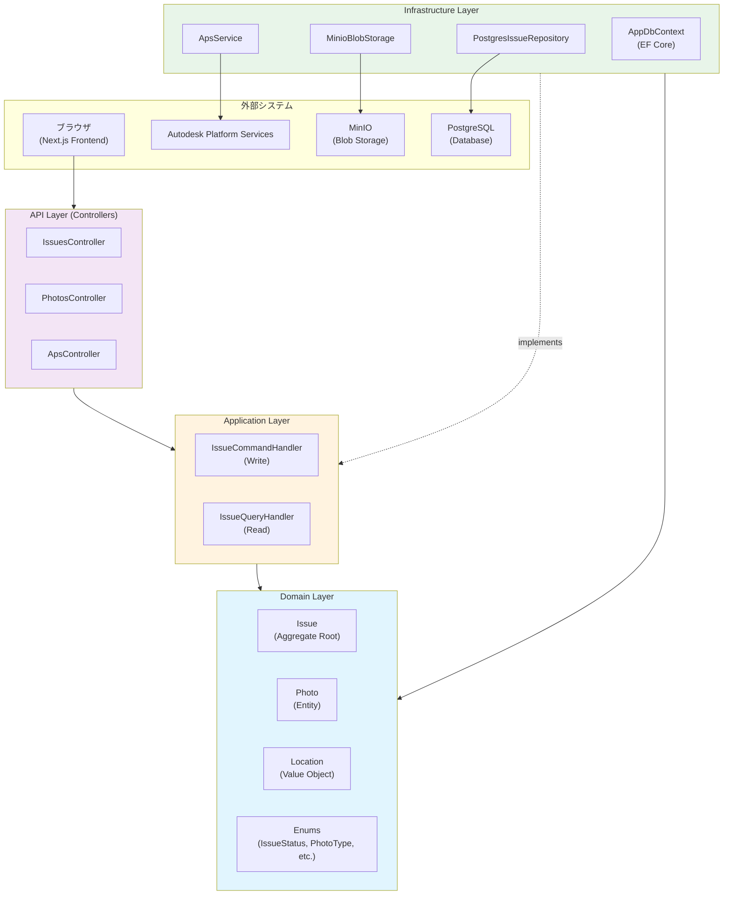
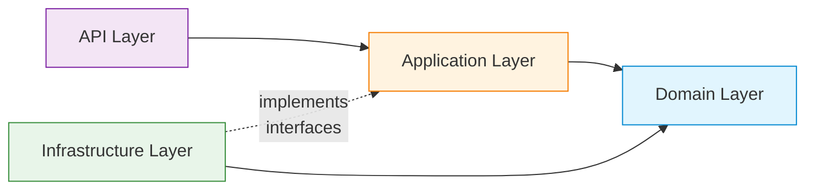
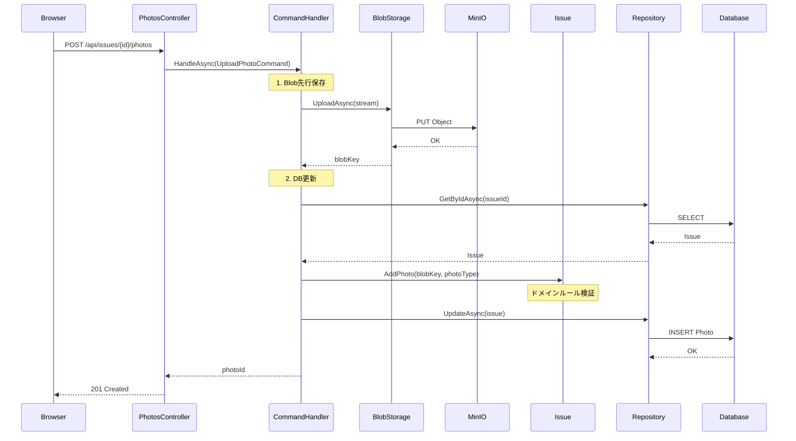
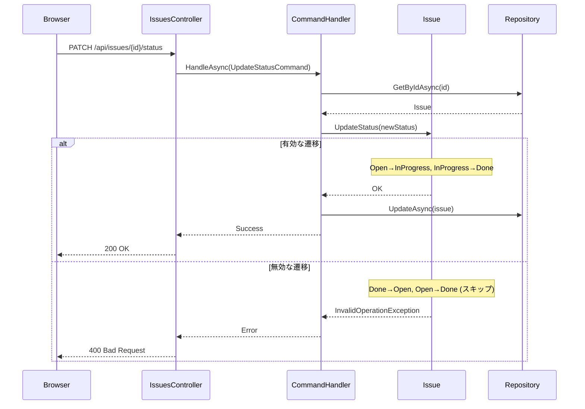

# アーキテクチャ設計書

## 概要

本システムはClean Architecture（クリーンアーキテクチャ）に基づき設計されている。
ドメインロジックがインフラ実装に依存しない構造を維持し、テスタビリティを確保する。

## レイヤー構成

### Mermaid: 全体レイヤー図



### Mermaid: 依存関係の方向



**ポイント**:
- すべての矢印は **Domain Layer に向かう**
- Infrastructure は Application のインターフェースを **実装** する（点線）
- Domain Layer は他のどの層にも依存しない（純粋なビジネスロジック）

### テキスト版レイヤー図
```
┌─────────────────────────────────────────────┐
│  Frontend (Next.js)                          │
│  ApsViewer / IssueList / IssueDetail        │
└──────────────┬──────────────────────────────┘
               │ REST API (JSON)
┌──────────────▼──────────────────────────────┐
│  API Layer (.NET)                            │
│  IssuesController / PhotosController         │
│  ApsController (token proxy)                │
└──────────────┬──────────────────────────────┘
               │
┌──────────────▼──────────────────────────────┐
│  Application Layer                           │
│  IssueCommandHandler / IssueQueryHandler     │
│  (CQRS パターン)                             │
└──────────────┬──────────────────────────────┘
               │ IIssueRepository (interface)
┌──────────────▼──────────────────────────────┐
│  Domain Layer  ← 依存なし                    │
│  Issue (集約) / Location (値オブジェクト)     │
│  IssueStatus / IssueType (列挙型)           │
└──────────────┬──────────────────────────────┘
               │ 実装
┌──────────────▼──────────────────────────────┐
│  Infrastructure Layer                        │
│  PostgresIssueRepository / AppDbContext      │
│  MinioBlobStorage / ApsTokenProvider        │
└─────────────────────────────────────────────┘
```

## ドメインモデル

### Issue（集約ルート）
```
Issue
├── Id: Guid
├── Title: string
├── Description: string
├── IssueType: Safety | Quality | Progress | Other
├── Status: Open → InProgress → Done（逆行不可）
├── Location: Location（値オブジェクト）
├── Photos: Photo[]
├── CreatedAt: DateTime
└── UpdatedAt: DateTime
```

**状態遷移ルール**:
- `StartProgress()`: Open → InProgress（それ以外は InvalidOperationException）
- `Complete()`: InProgress → Done（それ以外は InvalidOperationException）
- Done 状態からの遷移は一切不可

### Location（値オブジェクト）
```
Location
├── Type: Element | Space
├── DbId: int?          # Element指摘: APS ViewerのdbId（必須）
└── WorldPosition: {X, Y, Z}?  # Space指摘: 3D座標（必須）
```

## APS Viewer 連携

### カメラ遷移の実装

指摘クリック時のカメラ遷移は以下のロジックで実装：
```typescript
// バウンディングボックスの対角長を基準にオフセット計算
const bbox = viewer.model.getBoundingBox();
const diagonal = bbox.getSize(new THREE.Vector3()).length();
const offset = Math.max(50, Math.min(500, diagonal * 0.15));

const eye = new THREE.Vector3(pos.x + offset, pos.y + offset, pos.z + offset);
viewer.navigation.setView(eye, target);
```

Revit MEPモデルはメートル単位（数十〜数百m）のため、固定オフセットではなくモデルスケールに対する比率でオフセットを決定する。

### APS Token Proxy

フロントエンドはAPS Client SecretをブラウザにExposedしない。
バックエンドの `ApsController` が2-legged OAuth トークンを取得・返却するプロキシとして機能する。
```
Browser → GET /api/aps/token → ApsController → Autodesk OAuth API
                              ↑ Client ID / Secret は環境変数のみ
```

## 写真管理フロー

### Mermaid: 写真アップロードシーケンス



### テキスト版
```
クライアント → POST /api/photos/upload
            → MinIO に保存（内部エンドポイント: storage:9000）
            → Presigned URL を生成
            → URL内の storage:9000 を localhost:9000 に書き換え
            → クライアントに返却
```

Dockerネットワーク内ではサービス名（`storage`）でDNS解決するが、
ブラウザからはアクセス不可のため Presigned URL のホスト名を書き換える。

### Mermaid: 状態遷移フロー



## テスト戦略

| レイヤー | テスト種別 | ツール |
|---------|---------|------|
| Domain | ユニットテスト | xUnit |
| Application | （未実装） | — |
| API | （未実装） | — |
| E2E | 手動確認 | — |

### ユニットテスト対象

- `IssueTests`: 状態遷移ガード・写真追加・説明更新（12ケース）
- `LocationTests`: Element/Space 生成・バリデーション・座標検証（9ケース）

## 環境変数

| 変数名 | 説明 | デフォルト |
|--------|------|----------|
| `APS_CLIENT_ID` | APS Client ID | — （必須） |
| `APS_CLIENT_SECRET` | APS Client Secret | — （必須） |
| `POSTGRES_HOST` | PostgreSQL ホスト | `db` |
| `POSTGRES_DB` | データベース名 | `issuemanager` |
| `MINIO_ENDPOINT` | MinIO 内部エンドポイント | `storage:9000` |
| `MINIO_EXTERNAL_ENDPOINT` | MinIO 外部エンドポイント（Presigned URL用） | `localhost:9000` |

## 外部依存の隔離（§8.5）

### APS依存の隔離

`ApsTokenProvider` はInfrastructure層に閉じており、Application/Domain層はAPSを一切知らない。
フロントエンドはバックエンドの `/api/aps/token` プロキシ経由でトークンを取得するため、
APS Client SecretはDockerコンテナ内の環境変数にのみ存在する。
```
Domain / Application  ←  依存なし
Infrastructure        ←  ApsTokenProvider（Autodesk OAuth API呼び出し）
API Layer             ←  ApsController（トークンプロキシ）
Frontend              ←  /api/aps/token のみ呼び出し（Secretは不可視）
```

### ストレージ依存の隔離

`IBlobStorage` インターフェースをApplication層で定義し、
`MinioBlobStorage` がInfrastructure層で実装する。
```csharp
// Application層（MinIOを知らない）
public interface IBlobStorage
{
    Task<string> UploadAsync(string key, Stream data, string contentType);
    Task<string> GetPresignedUrlAsync(string key);
}

// Infrastructure層（MinIO実装）
public class MinioBlobStorage : IBlobStorage { ... }
```

本番環境ではAzure Blob Storage実装（`AzureBlobStorage : IBlobStorage`）に
差し替えるだけでアプリケーションコードを変更する必要がない。

---

## 将来本番構成（§8.6）

### クラウド移行

| コンポーネント | ローカル（現状） | クラウド移行先 |
|-------------|--------------|-------------|
| DB | PostgreSQL (Docker) | Azure Database for PostgreSQL / AWS RDS |
| Blob Storage | MinIO | Azure Blob Storage / AWS S3 |
| コンテナ実行 | Docker Compose | Azure Container Apps / AWS ECS |
| APS認証情報 | .env ファイル | Azure Key Vault / AWS Secrets Manager |

`IBlobStorage` インターフェースにより、ストレージ移行はImplementation差し替えのみで完結する。

### 認証の追加

現状は認証なし。本番導入時の設計方針：

- **JWT Bearer認証**をAPI Layerに追加（ASP.NET Core標準）
- ユーザー情報はDomain/Applicationに**漏らさない**（ICurrentUser インターフェース経由）
- APS OAuthとのSSO統合も選択肢（Autodesk ID Provider）

### マルチユーザー対応

- `issues` テーブルに `created_by: UUID` カラム追加
- `users` テーブルと `assignee_id` で担当者管理
- Row-Level Security (PostgreSQL RLS) でプロジェクトスコープのデータ分離

### 大量データ時の設計方針

| 課題 | 対応策 |
|------|-------|
| 指摘件数増加（10万件超） | `status` / `issue_type` / `created_at` にインデックス追加。Queryハンドラにページネーション実装 |
| 写真ストレージ肥大化 | S3 / Blob Storage Lifecycle Policyで古いオブジェクトを低コストストレージに自動移動 |
| 読み取り負荷集中 | QueryモデルをCommandモデルから分離（CQRS完全分離）。読み取り専用ReplicaへのQuery振り分け |
| BIMモデル大規模化 | APS Viewer のFragmentListレベルでのLOD制御。Partial loadingの活用 |
