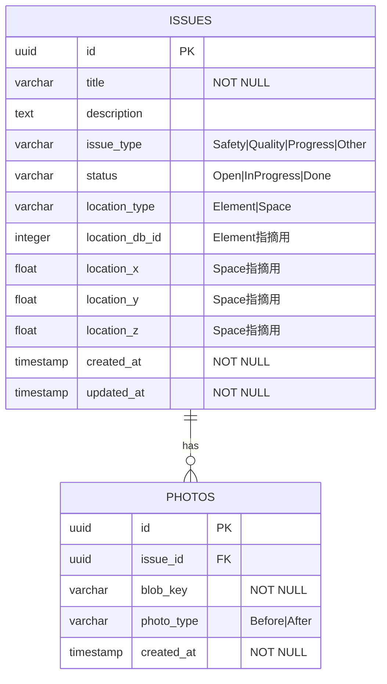
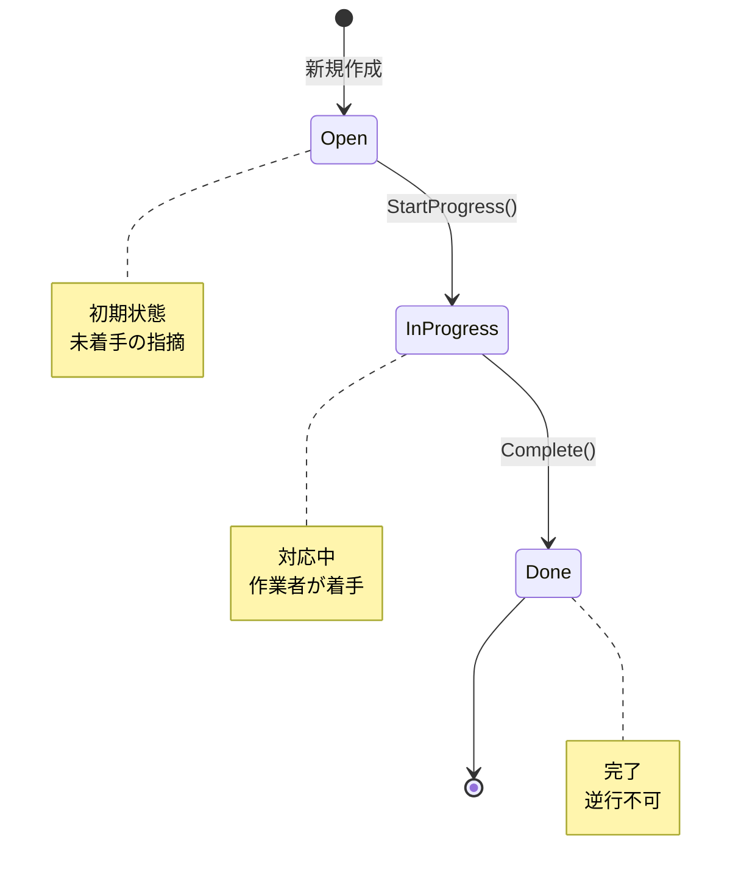

# ER図（ドメインモデル）

## Mermaid ER図



## エンティティ関係図（テキスト版）
```
issues
├── id: UUID (PK)
├── title: VARCHAR(255) NOT NULL
├── description: TEXT
├── issue_type: VARCHAR(50) NOT NULL  -- Safety | Quality | Progress | Other
├── status: VARCHAR(50) NOT NULL      -- Open | InProgress | Done
├── location_type: VARCHAR(50) NOT NULL  -- Element | Space
├── location_db_id: INTEGER           -- Element指摘: APS ViewerのdbId
├── location_x: DOUBLE PRECISION      -- Space指摘: X座標
├── location_y: DOUBLE PRECISION      -- Space指摘: Y座標
├── location_z: DOUBLE PRECISION      -- Space指摘: Z座標
├── created_at: TIMESTAMP NOT NULL
└── updated_at: TIMESTAMP NOT NULL

photos
├── id: UUID (PK)
├── issue_id: UUID (FK → issues.id)
├── blob_key: VARCHAR(500) NOT NULL   -- MinIOオブジェクトキー
├── photo_type: VARCHAR(100)          -- Before / After
└── created_at: TIMESTAMP NOT NULL
```

**リレーション**: issues 1 ─── 0..* photos

## 状態遷移図



## 設計上の判断

### Locationのインライン埋め込み

LocationはIssueの値オブジェクトであり、独立したライフサイクルを持たない。
そのため別テーブルに正規化せず、issuesテーブルにインライン埋め込みとした。

- `location_type = Element` の場合: `location_db_id` のみ使用
- `location_type = Space` の場合: `location_x/y/z` のみ使用

アプリケーション層でバリデーションを行い、不整合な組み合わせを防ぐ。

### PhotoのBlobキー分離戦略

写真バイナリはDBに保存せず、MinIOに保存してキーのみをDBに持つ。
```
DB (photos.blob_key) ──参照──→ MinIO (project-bucket/{blob_key})
```

**整合性戦略**:
1. MinIOへのアップロード成功後にDBへ登録（MinIO先行）
2. Issue削除時はPhotosレコードを削除し、MinIOオブジェクトは非同期でGC
3. 現状POCのため孤立オブジェクトは許容。本番ではS3 Lifecycle Policyで対処

## 将来拡張

| 拡張 | 対応方針 |
|------|---------|
| マルチプロジェクト対応 | `projects` テーブル追加、issuesに `project_id` FK追加 |
| 担当者アサイン | `users` テーブル追加、issuesに `assignee_id` FK追加 |
| コメント履歴 | `issue_comments` テーブル追加（issue_id, author, body, created_at） |
| 変更履歴 | `issue_history` テーブル追加（ドメインイベント永続化） |
