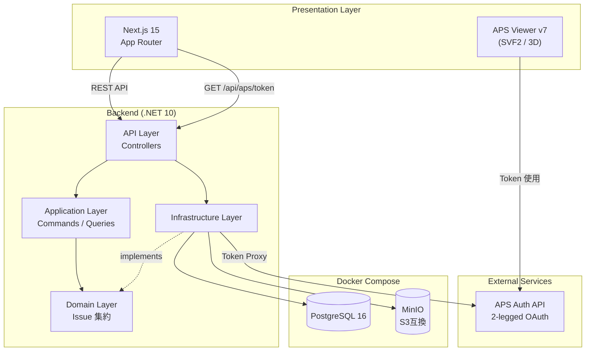
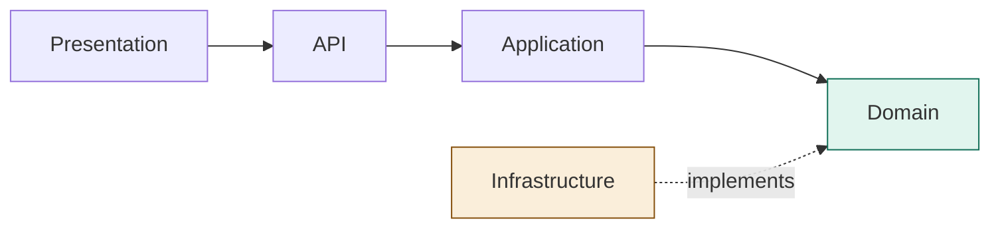

# アーキテクチャ図

## 全体構成

```mermaid
graph TB
    subgraph Browser["Presentation Layer"]
        Viewer["APS Viewer v7<br/>(SVF2 / 3D)"]
        UI["Next.js 15<br/>App Router"]
    end

    subgraph Backend["Backend (.NET 10)"]
        API["API Layer<br/>Controllers"]
        App["Application Layer<br/>Commands / Queries"]
        Domain["Domain Layer<br/>Issue 集約"]
        Infra["Infrastructure Layer"]
    end

    subgraph External["External Services"]
        APS["APS Auth API<br/>2-legged OAuth"]
    end

    subgraph Docker["Docker Compose"]
        DB[(PostgreSQL 16)]
        Blob[(MinIO<br/>S3互換)]
    end

    UI -->|REST API| API
    UI -->|GET /api/aps/token| API
    Viewer -->|Token 使用| APS
    API --> App
    App --> Domain
    Infra -.->|implements| Domain
    Infra --> DB
    Infra --> Blob
    Infra -->|Token Proxy| APS
    API --> Infra
```

## 依存方向

```mermaid
graph LR
    P["Presentation"] --> A["API"] --> App["Application"] --> D["Domain"]
    I["Infrastructure"] -.->|implements| D
    style D fill:#E1F5EE,stroke:#0F6E56
    style I fill:#FAEEDA,stroke:#854F0B
```

Domain層はどの層にも依存しない。Infrastructure層はDomain層のインターフェースを実装する（依存性逆転原則）。
