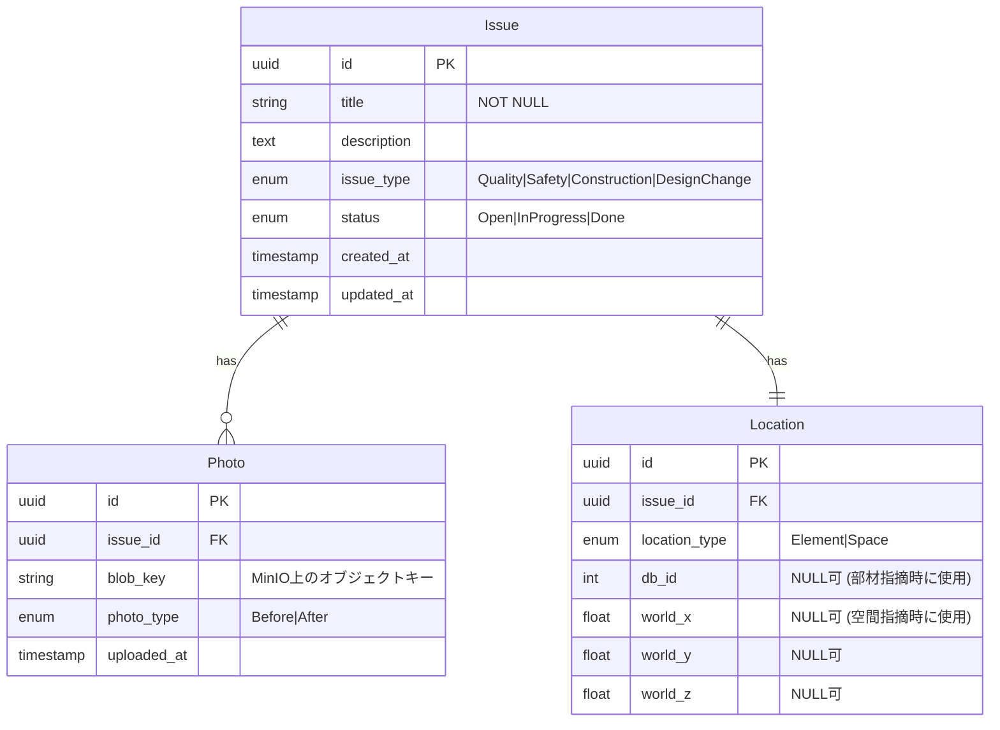

# ER図（ドメインモデル）

## Issue / Location / Photo

## 設計判断

- **Location を値オブジェクトとして扱う**: DDDの観点ではLocationはIssueの一部。テーブルはEF Core の Owned Entity として Issue テーブルに埋め込むか、別テーブルとするかは実装時に決定
- **Photo は子エンティティ**: Issue集約の境界内。Issue経由でのみ追加・参照
- **BlobKey**: MinIO上のオブジェクトパス。実ファイルはDBに保存しない
- **状態遷移**: `status` カラムはenum。遷移ルールはDomain層のIssueエンティティが制御（DBトリガーは使わない）
