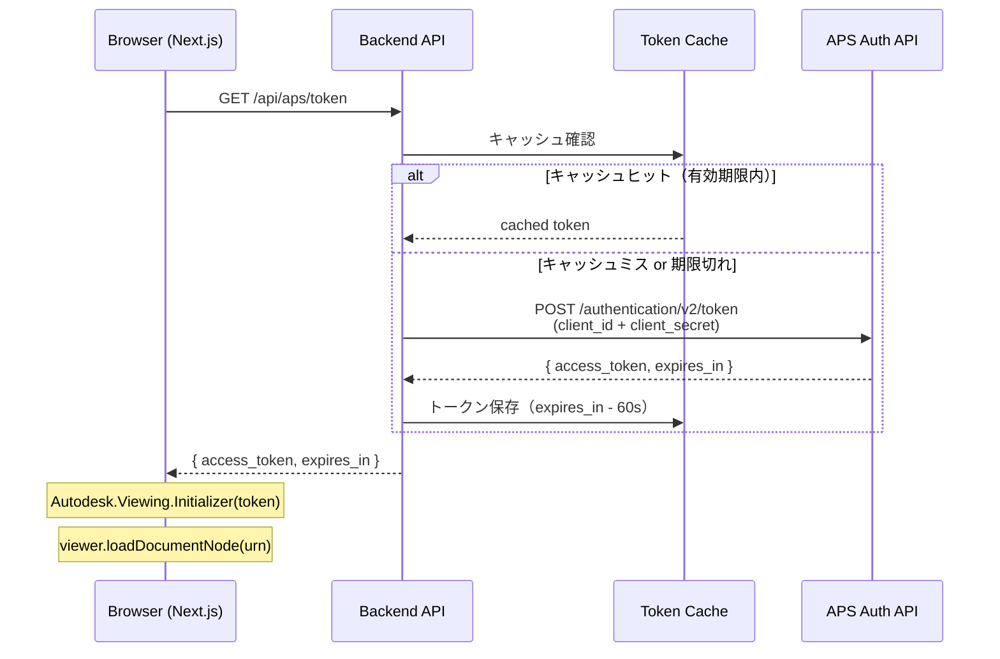
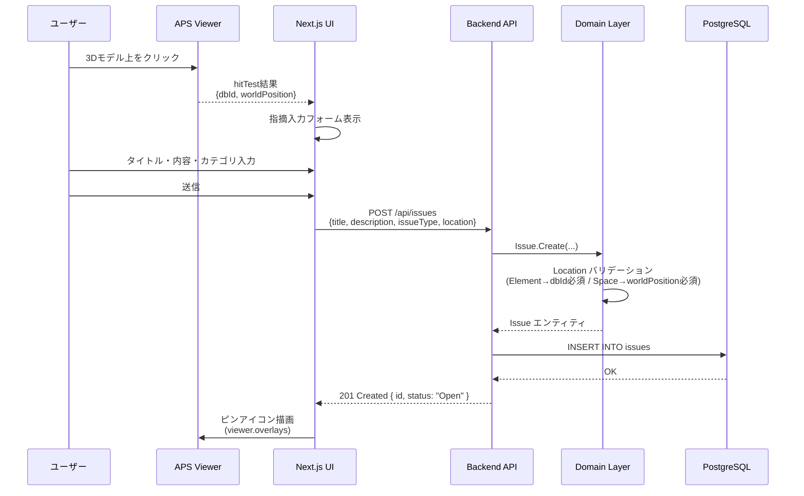
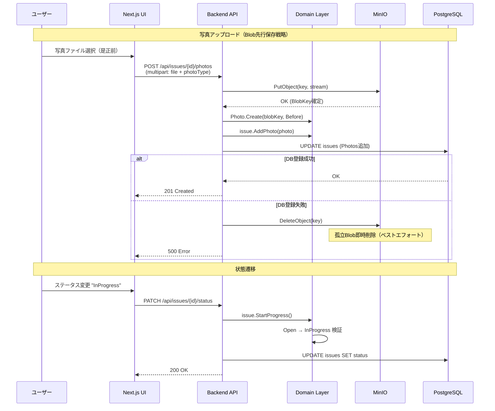
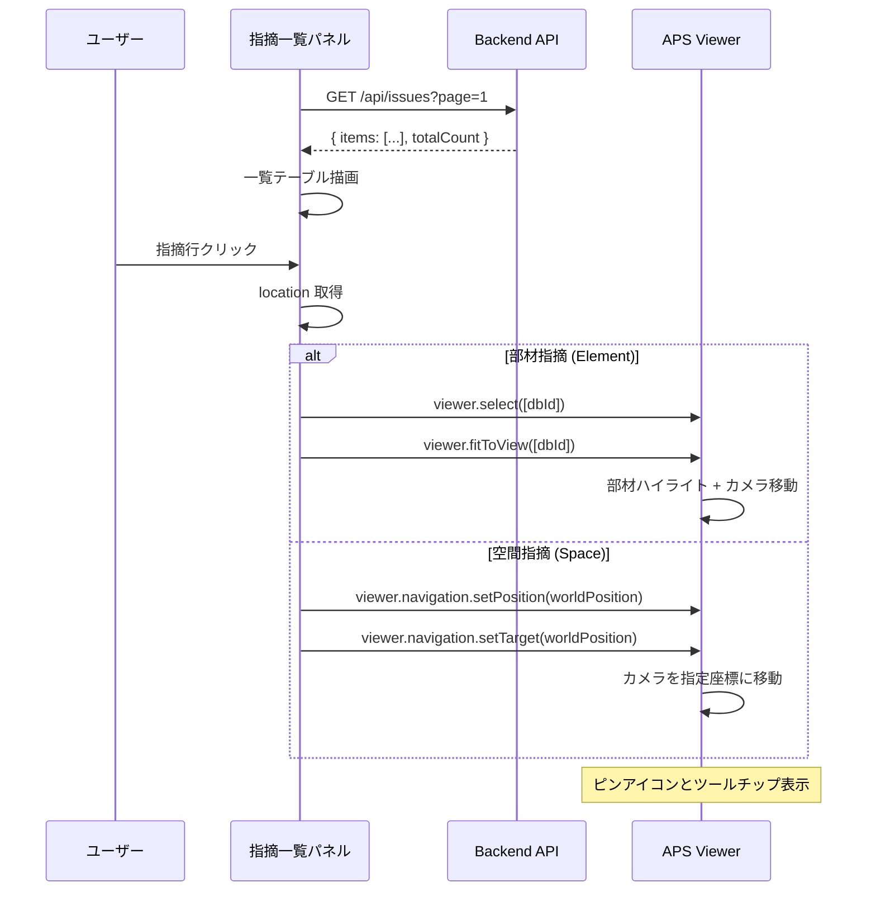

# シーケンス図

## 1. Token Proxy（APS認証フロー）

**設計判断**: Client Secret はサーバーサイドのみ。キャッシュ有効期限はAPIレスポンスの `expires_in` より60秒短く設定し、期限切れトークンをフロントに返さない。

---

## 2. ピン登録（指摘作成フロー）

---

## 3. 指摘CRUD + 写真アップロード

---

## 4. 一覧→3D位置連携

