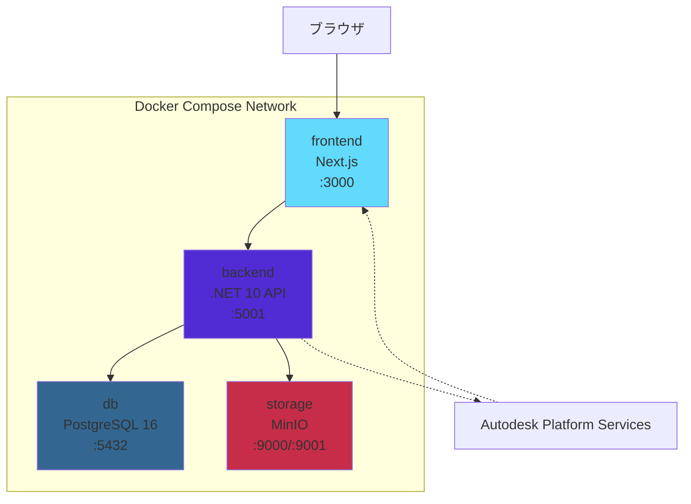
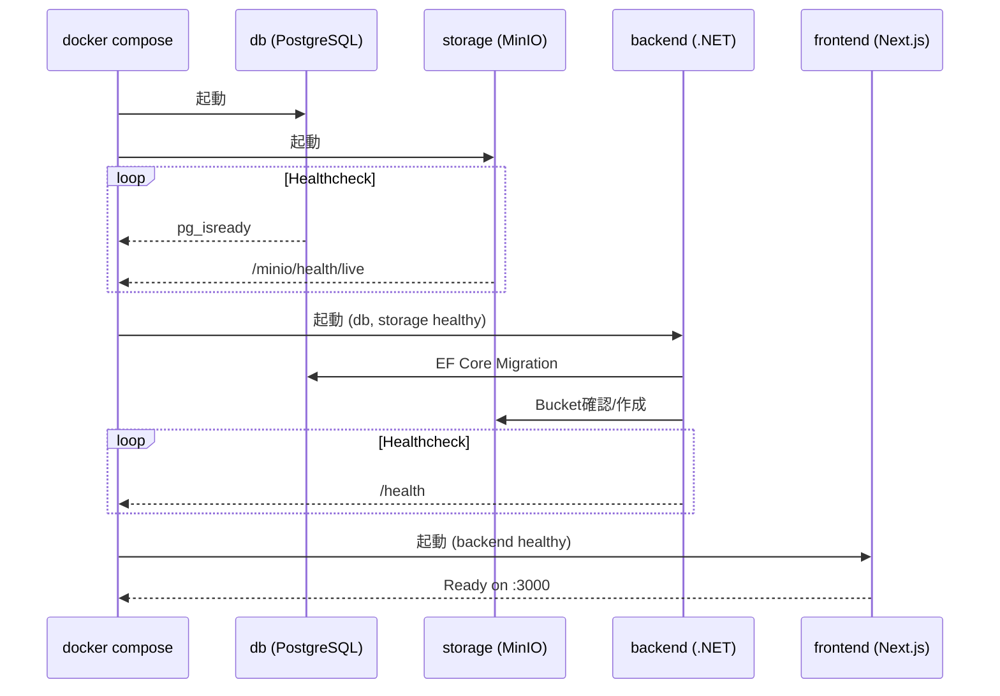

# Docker Compose 構成ガイド

## サービス構成図



## docker-compose.yml

```yaml
services:
  frontend:
    build:
      context: ./frontend
      dockerfile: Dockerfile
      args:
        NEXT_PUBLIC_API_BASE_URL: "http://localhost:5001"
    ports: ["3000:3000"]
    depends_on: { backend: { condition: service_healthy } }

  backend:
    build: { context: ./backend, dockerfile: Dockerfile }
    ports: ["5001:5001"]
    env_file: .env
    depends_on:
      db: { condition: service_healthy }
      storage: { condition: service_healthy }
    healthcheck:
      test: ["CMD-SHELL", "wget -qO- http://localhost:5001/health || exit 1"]
      interval: 10s
      timeout: 5s
      retries: 5

  db:
    image: postgres:16-alpine
    ports: ["5432:5432"]
    environment:
      POSTGRES_DB: issue_manager
      POSTGRES_USER: postgres
      POSTGRES_PASSWORD: postgres
    volumes: [postgres_data:/var/lib/postgresql/data]
    healthcheck:
      test: ["CMD-SHELL", "pg_isready -U postgres"]
      interval: 5s
      timeout: 5s
      retries: 5

  storage:
    image: minio/minio:latest
    ports: ["9000:9000", "9001:9001"]
    environment:
      MINIO_ROOT_USER: minioadmin
      MINIO_ROOT_PASSWORD: minioadmin
    command: server /data --console-address ":9001"
    volumes: [minio_data:/data]
    healthcheck:
      test: ["CMD", "curl", "-f", "http://localhost:9000/minio/health/live"]
      interval: 5s
      timeout: 5s
      retries: 5

volumes:
  postgres_data:
  minio_data:
```

## サービス詳細

### frontend

| 項目 | 値 |
|------|-----|
| ベースイメージ | node:20-alpine |
| フレームワーク | Next.js 15.5.12 |
| ポート | 3000 |
| ビルド引数 | `NEXT_PUBLIC_API_BASE_URL` |
| 依存 | backend (healthy) |

### backend

| 項目 | 値 |
|------|-----|
| ベースイメージ | mcr.microsoft.com/dotnet/aspnet:10.0 |
| フレームワーク | .NET 10 / ASP.NET Core |
| ポート | 5001 (macOS AirPlay回避) |
| 環境変数 | .env ファイルから読み込み |
| 依存 | db, storage (healthy) |
| ヘルスチェック | wget (curl未搭載のため) |

### db

| 項目 | 値 |
|------|-----|
| イメージ | postgres:16-alpine |
| ポート | 5432 |
| データベース名 | issue_manager |
| ユーザー | postgres |
| パスワード | postgres |
| ボリューム | postgres_data |

### storage

| 項目 | 値 |
|------|-----|
| イメージ | minio/minio:latest |
| API ポート | 9000 |
| コンソールポート | 9001 |
| ユーザー | minioadmin |
| パスワード | minioadmin |
| ボリューム | minio_data |
| バケットポリシー | public download |

## 環境変数（.env）

```env
# APS認証情報（必須）
APS_CLIENT_ID=your_client_id
APS_CLIENT_SECRET=your_client_secret
APS_MODEL_URN=your_model_urn

# PostgreSQL
POSTGRES_HOST=db
POSTGRES_PORT=5432
POSTGRES_DB=issue_manager
POSTGRES_USER=postgres
POSTGRES_PASSWORD=postgres

# MinIO
MINIO_ENDPOINT=storage:9000
MINIO_EXTERNAL_ENDPOINT=localhost:9000
MINIO_ACCESS_KEY=minioadmin
MINIO_SECRET_KEY=minioadmin
MINIO_BUCKET=issue-photos
MINIO_USE_SSL=false
```

## コマンド一覧

| コマンド | 説明 |
|---------|------|
| `docker compose up -d` | 全サービス起動 |
| `docker compose up --build -d` | 再ビルドして起動 |
| `docker compose down` | 停止 |
| `docker compose down -v` | 停止 + ボリューム削除 |
| `docker compose logs -f` | 全ログ表示 |
| `docker compose logs -f backend` | backendログのみ |
| `docker compose ps` | サービス状態確認 |
| `docker compose exec backend bash` | backendコンテナに入る |

## 起動シーケンス



## トラブルシューティング

### ポート競合

```bash
# macOS: AirPlayがポート5000を使用
# 解決: backendはポート5001を使用

# ポート使用確認
lsof -i :5000
lsof -i :5001
```

### ヘルスチェック失敗

```bash
# backendのヘルスチェック確認
docker compose logs backend | grep health

# 手動でヘルスチェック
curl http://localhost:5001/health
```

### MinIOバケット作成

```bash
# MinIOコンソールにアクセス
open http://localhost:9001
# ログイン: minioadmin / minioadmin
# Buckets → Create Bucket → "issue-photos"
# Access Policy → "public" に設定
```

### データベースリセット

```bash
docker compose down -v
docker compose up -d
```

## URL一覧

| URL | サービス |
|-----|---------|
| http://localhost:3000 | フロントエンド |
| http://localhost:5001/swagger | API ドキュメント |
| http://localhost:5001/health | ヘルスチェック |
| http://localhost:9001 | MinIO コンソール |
| http://localhost:9000 | MinIO API |
