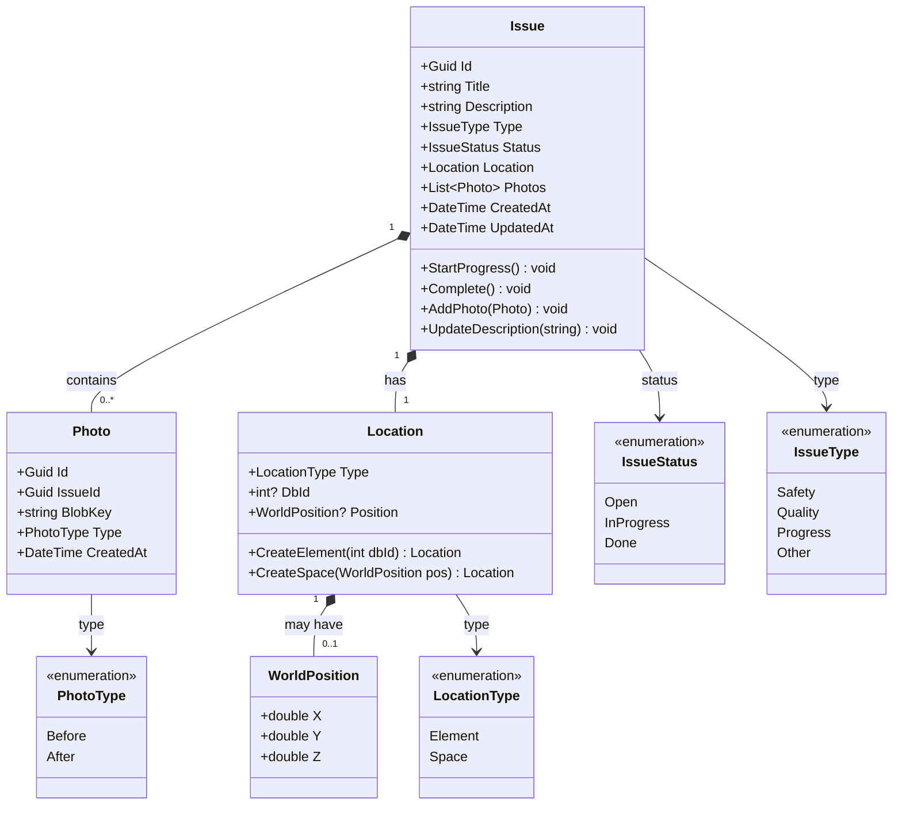
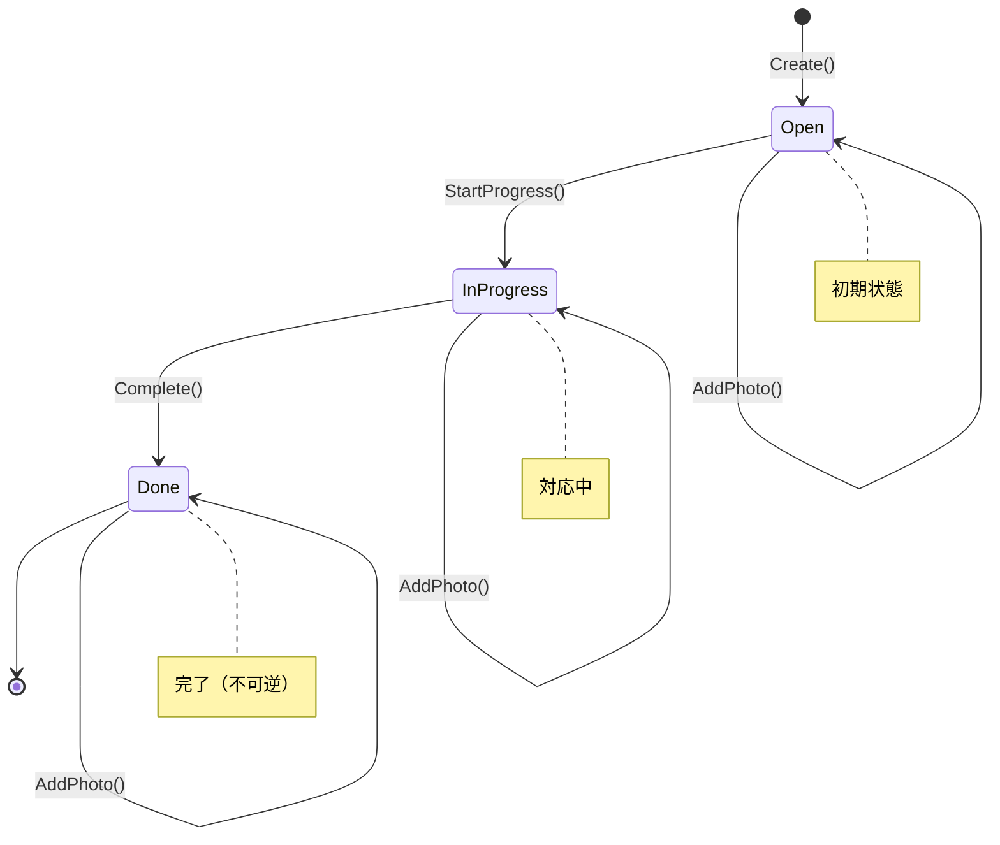
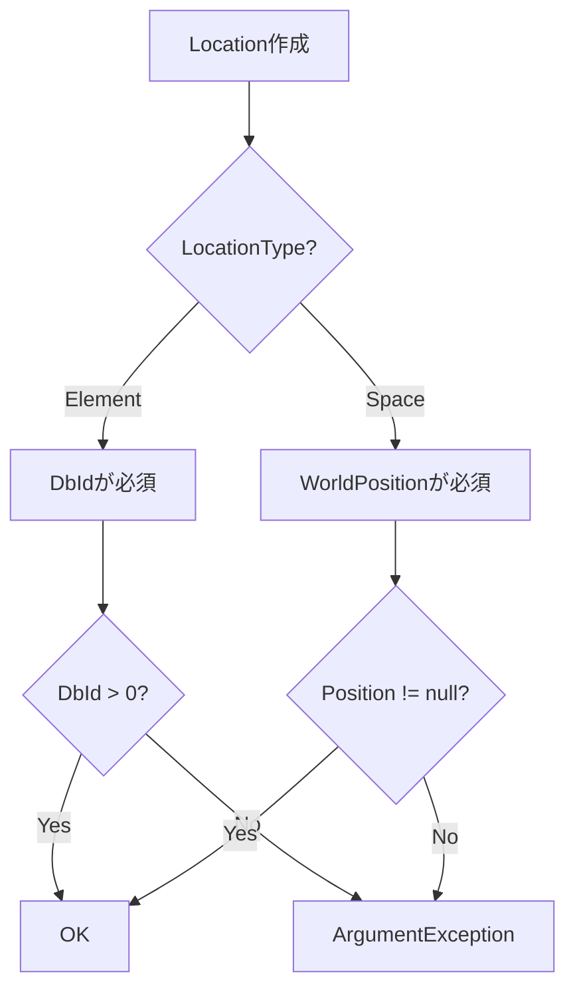
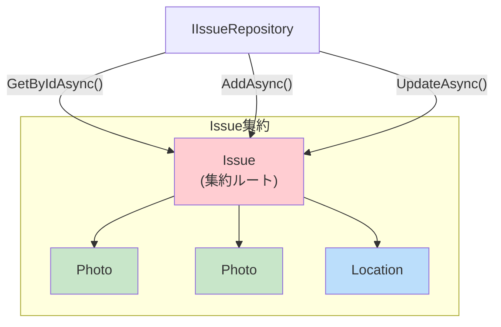
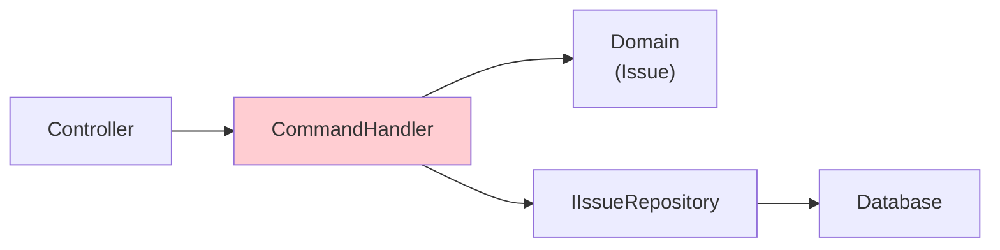
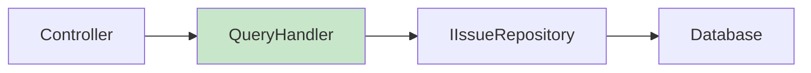

# ドメインモデル設計書

## 概要

本システムはDDD（Domain-Driven Design）の原則に基づき設計されています。
**Issue**を集約ルートとし、**Photo**を子エンティティ、**Location**を値オブジェクトとして構成しています。

---

## クラス図



---

## Issue（集約ルート）

### 責務
- 指摘のライフサイクル管理
- 状態遷移の制御（ビジネスルールの強制）
- 写真の追加管理

### 状態遷移ルール



### ビジネスルール

| ルール | 実装 | テストケース |
|--------|------|-------------|
| Titleは空不可 | コンストラクタでArgumentException | `Create_WithEmptyTitle_ThrowsException` |
| Open→InProgress のみ許可 | `StartProgress()` でstatus検証 | `StartProgress_FromOpen_Succeeds` |
| InProgress→Done のみ許可 | `Complete()` でstatus検証 | `Complete_FromInProgress_Succeeds` |
| Done からの遷移不可 | 両メソッドでInvalidOperationException | `StartProgress_FromDone_ThrowsException` |
| スキップ不可（Open→Done） | `Complete()` でstatus検証 | `Complete_FromOpen_ThrowsException` |

### コード例

```csharp
public class Issue
{
    public Guid Id { get; private set; }
    public string Title { get; private set; }
    public IssueStatus Status { get; private set; }
    public Location Location { get; private set; }
    private readonly List<Photo> _photos = new();
    public IReadOnlyList<Photo> Photos => _photos.AsReadOnly();

    public void StartProgress()
    {
        if (Status != IssueStatus.Open)
            throw new InvalidOperationException(
                $"Cannot start progress from status: {Status}");
        Status = IssueStatus.InProgress;
        UpdatedAt = DateTime.UtcNow;
    }

    public void Complete()
    {
        if (Status != IssueStatus.InProgress)
            throw new InvalidOperationException(
                $"Cannot complete from status: {Status}");
        Status = IssueStatus.Done;
        UpdatedAt = DateTime.UtcNow;
    }

    public void AddPhoto(Photo photo)
    {
        // どの状態でも写真追加は可能
        _photos.Add(photo);
        UpdatedAt = DateTime.UtcNow;
    }
}
```

---

## Location（値オブジェクト）

### 責務
- 3D空間における指摘位置の表現
- Element指摘とSpace指摘の区別
- 位置情報の不変性保証

### 設計判断

| 種別 | 必須フィールド | 用途 |
|------|---------------|------|
| Element | `DbId` | BIM要素（配管・壁など）への指摘 |
| Space | `WorldPosition` | 空間上の任意の点への指摘 |

### バリデーションルール



### コード例

```csharp
public record Location
{
    public LocationType Type { get; }
    public int? DbId { get; }
    public WorldPosition? WorldPosition { get; }

    private Location(LocationType type, int? dbId, WorldPosition? pos)
    {
        Type = type;
        DbId = dbId;
        WorldPosition = pos;
    }

    public static Location CreateElement(int dbId)
    {
        if (dbId <= 0)
            throw new ArgumentException("DbId must be positive", nameof(dbId));
        return new Location(LocationType.Element, dbId, null);
    }

    public static Location CreateSpace(double x, double y, double z)
    {
        return new Location(LocationType.Space, null, new WorldPosition(x, y, z));
    }
}
```

---

## Photo（子エンティティ）

### 責務
- 写真メタデータの管理
- Blobストレージへの参照（BlobKey）
- 是正前/是正後の区別

### 設計判断

| 項目 | 決定 | 理由 |
|------|------|------|
| バイナリ保存先 | MinIO (Blob) | DBの肥大化防止 |
| DB保存内容 | BlobKeyのみ | 参照整合性の維持 |
| 削除戦略 | 孤立Blob許容 | POCのため簡易化 |

### Blobキー構造

```
issues/{issueId}/photos/{photoId}
└─────────────────────────────────┘
            BlobKey
```

---

## 集約境界



### 集約ルール

1. **集約ルート経由のアクセス**: PhotoやLocationは直接操作せず、必ずIssue経由でアクセス
2. **トランザクション境界**: Issue単位でのトランザクション管理
3. **ID参照**: 集約外への参照はIDのみ（将来のProject参照など）

---

## ユニットテスト

### テストカバレッジ

| ドメインクラス | テストケース数 | カバー範囲 |
|---------------|---------------|-----------|
| Issue | 12 | 状態遷移・写真追加・説明更新 |
| Location | 9 | Element/Space生成・バリデーション |
| **合計** | **21** | |

### テスト構造

```
backend/tests/Domain/
├── IssueTests.cs
│   ├── Create_WithValidData_Succeeds
│   ├── Create_WithEmptyTitle_ThrowsException
│   ├── StartProgress_FromOpen_Succeeds
│   ├── StartProgress_FromInProgress_ThrowsException
│   ├── StartProgress_FromDone_ThrowsException
│   ├── Complete_FromInProgress_Succeeds
│   ├── Complete_FromOpen_ThrowsException
│   ├── Complete_FromDone_ThrowsException
│   ├── AddPhoto_InAnyStatus_Succeeds
│   ├── UpdateDescription_UpdatesTimestamp
│   └── ...
└── LocationTests.cs
    ├── CreateElement_WithValidDbId_Succeeds
    ├── CreateElement_WithZeroDbId_ThrowsException
    ├── CreateElement_WithNegativeDbId_ThrowsException
    ├── CreateSpace_WithValidPosition_Succeeds
    └── ...
```

---

## CQRS分離

### Command（書き込み）



| Command | 説明 |
|---------|------|
| `CreateIssueCommand` | 新規指摘作成 |
| `UpdateStatusCommand` | 状態遷移 |
| `UploadPhotoCommand` | 写真追加 |

### Query（読み取り）



| Query | 説明 |
|-------|------|
| `GetIssuesQuery` | 一覧取得（ページネーション） |
| `GetIssueByIdQuery` | 詳細取得 |

---

## 将来の拡張

| 拡張 | 変更箇所 | 影響度 |
|------|---------|--------|
| 担当者アサイン | Issue に AssigneeId 追加 | 低 |
| コメント機能 | Comment エンティティ追加 | 低 |
| マルチプロジェクト | Project 集約追加、Issue に ProjectId | 中 |
| 監査ログ | DomainEvent + EventSourcing | 高 |
